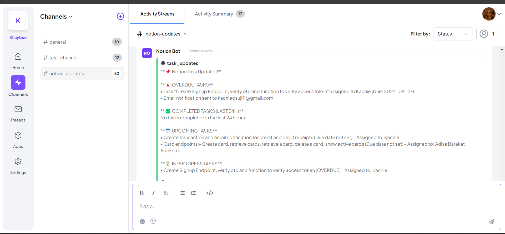
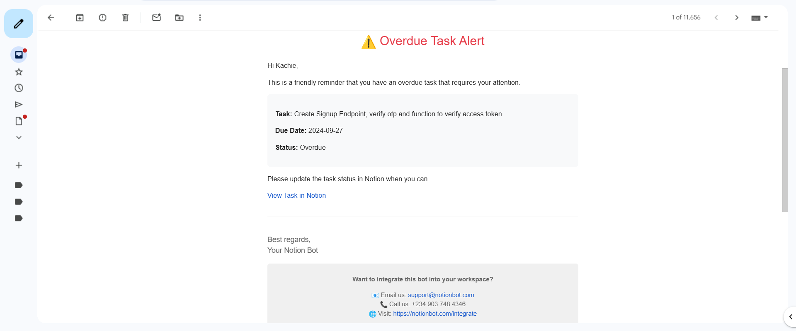
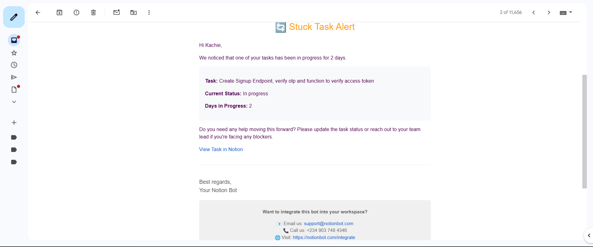

# notion-updates

## Description

A Node.js application that monitors Notion tasks and sends webhook notifications for overdue or stuck items. This helps teams stay on top of their tasks by providing automated alerts when action is needed.

## Features

- Automated monitoring of Notion tasks
- Webhook notifications for overdue tasks
- Alerts for tasks that haven't moved status in configured time
- Customizable notification settings
- Easy integration with popular messaging platforms

## Prerequisites

- Node.js 16.x or higher
- A Notion integration token
- Webhook URL (Telex, or other platform)

## Installation

1. Clone the repository:
   ```bash
   git clone https://github.com/telexintegrations/notion-updates.git
   cd notion-updates
   ```

2. Install dependencies:
   ```bash
   npm install
   ```

3. Create a `.env` file in the root directory with your configuration:
   ```
   NOTION_TOKEN=your_notion_integration_token
   WEBHOOK_URL=your_webhook_url
   PORT=3000
   ```

## Usage

1. Start the server:
   ```bash
   npm start
   ```

2. The application will:
   - Monitor your Notion tasks at configured intervals
   - Send notifications when tasks become overdue
   - Alert you when tasks are stuck in the same status

## Configuration

Customize the application behavior by modifying `config.js`:
- Notification frequency
- Task status definitions
- Overdue thresholds
- Webhook message format

## Contributing

Contributions are welcome! Please follow these steps:

1. Fork the repository
2. Create a feature branch (`git checkout -b feature/amazing-feature`)
3. Commit your changes (`git commit -m 'Add amazing feature'`)
4. Push to the branch (`git push origin feature/amazing-feature`)
5. Open a Pull Request


## Support

If you encounter any problems or have suggestions, please [open an issue](https://github.com/Khaybee/telex-notion-integration/issues).

## Testing

### Local Development
1. Run the development server with hot-reload:
   ```bash
   npm run dev
   ```

### Testing
1. Run the test suite:
   ```bash
   npm test
   ```

The test suite uses Jest and includes tests for:
- Task monitoring and status updates
- Due date calculations
- Webhook notification formatting
- Error handling and retries

### Manual Testing Steps

1. Start the application:
   ```bash
   npm start
   ```

2. Test the integration:
   - Create a test task in Notion
   - Set a due date to today
   - Wait for the configured check interval
   - Verify that you receive a notification in your configured webhook

### Example Workflow

1. Task Creation:
   - Create a task in Notion
   - Assign it to a team member
   - Set a due date

2. Status Changes:
   - Move task between status columns
   - Observe webhook notifications
   - Verify timing of alerts

3. Overdue Scenarios:
   - Let a task pass its due date
   - Confirm overdue notification
   - Test different priority levels

## Integration Preview


*Example of an overdue task notification in Telex*


 
*Task status monitoring alert*

## Deployment

1. Build the application:
   ```bash
   npm run build
   ```

2. Start the production server:
   ```bash
   npm start
   ```

3. Configure environment variables on your production server:
   - Set `NODE_ENV=production`
   - Configure secure credentials
   - Set up logging


